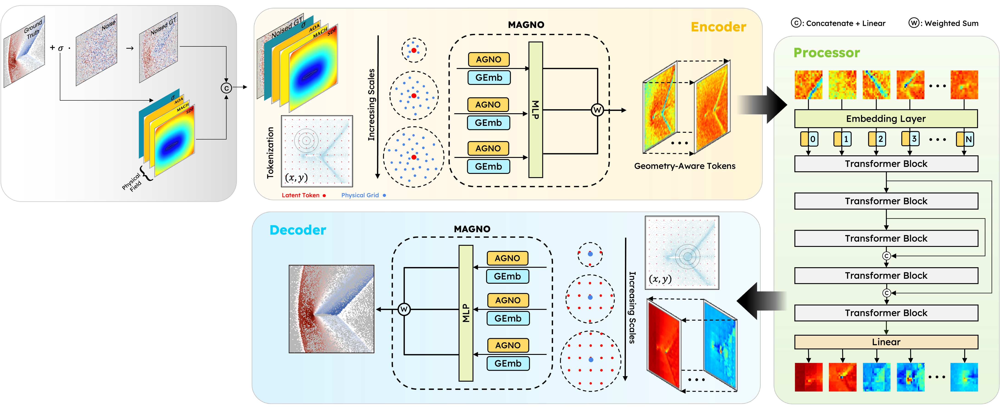
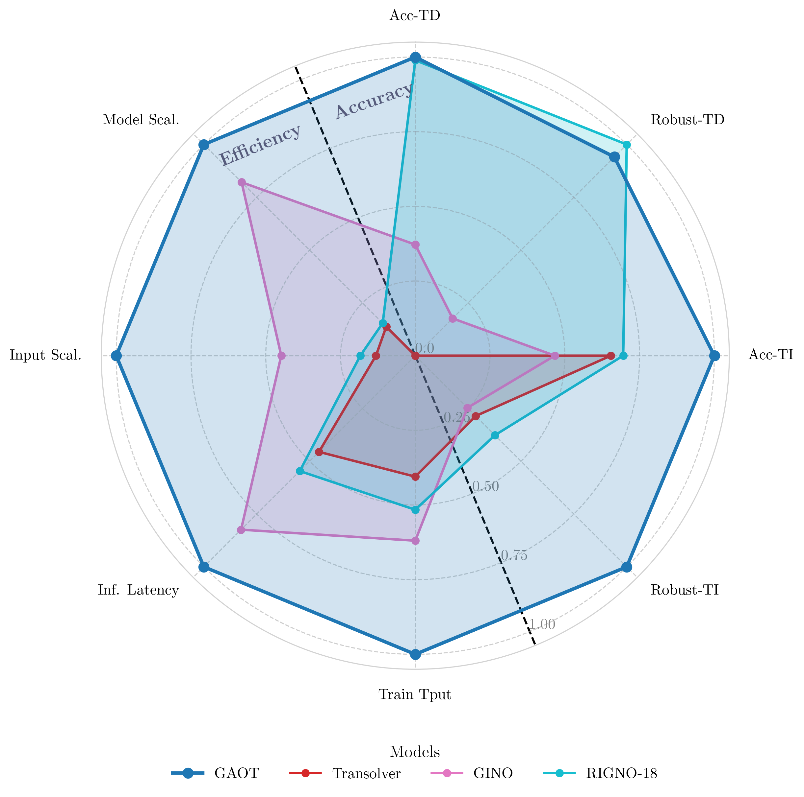
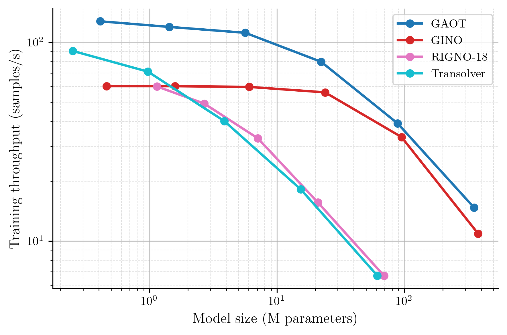

# Geometry Aware Score-based Diffusion Models for Unstructured PDEs on Arbitrary Domains

This repository contains the official source code for the paper:
**"Geometry-Aware Diffusion Models for Unstructured Datasets"** 

For the implementation of large 3D datasets, e.g., DrivaerNet++, please refer to our other repository: [**GAOT-3D**](https://github.com/Shizheng-Wen/GAOT-3D).

## :bulb: Abstract

Scientific simulations and experiments often produce field data on irregular, adaptive meshes, where resolution is concentrated in regions of complex dynamics. Learning directly from such unstructured data is challenging because flattening node values discards geometric relationships that are critical for accuracy. We introduce a framework that couples a Geometry-Aware Operator Transformer (GAOT) with a grid-based diffusion model (GenCFD) to enable generative modeling on unstructured scientific datasets. GAOT encodes fields defined on arbitrary meshes—together with their geometric context—into a structured latent representation on which standard diffusion architectures operate effectively; a symmetric decoder maps the generated latent fields back to the original mesh. This design preserves geometric information while allowing us to leverage mature, high-capacity diffusion models developed for regular grids. The resulting approach supports variable mesh density and topology, and is applicable to tasks such as reconstruction, forecasting, and surrogate modeling. We demonstrate how combining GAOT with GenCFD yields a practical, modular pathway for diffusion models on unstructured scientific data.

<p align="center">
  
  <br/>
  <em>Figure 1: GAOT Model Architecture.</em>
</p>


## :rocket: Key Features

* **Hybrid Architecture:** Combines the strengths of Graph Neural Operators (for geometry awareness) and Transformers (for global context modeling).
* **Multiscale Processing:** Employs multiscale attentional GNO encoders/decoders to capture features at different resolutions.
* **Geometry Embeddings:** Explicitly incorporates geometric information into the learning process.
* **Efficiency and Scalability:** Designed with computational performance in mind, enabling application to large and complex problems.
* **Versatility:** Adaptable to various PDE learning tasks with different geometric and temporal characteristics.


## 📈 Results

### Overall Model Performance

GAOT demonstrates superior performance across multiple metrics when compared to selected baselines (RIGNO-18 for Graph-based, GINO for FNO-based, and Transolver for Transformer-based models). The radar chart below provides a comprehensive overview.

<p align="center">
  
  <br/>
  <em>Figure 2: Normalized performance of GAOT and baselines across eight axes, covering accuracy (Acc.), robustness (Robust), throughput (Tput), scalability (Scal.) on time-dependent (TD) and time-independent (TI) tasks.</em>
</p>

### Throughput and Scalability

GAOT shows excellent throughput and scalability with increasing grid resolution and compared to other models.

<table align="center" style="border: none;">
  <tr>
    <td align="center" width="50%" style="border: none;">
      <br/>
      <em>Figure 3: Grid Resolution vs. Throughput.</em>
    </td>
    <td align="center" width="50%" style="border: none;">
      <br/>
      <em>Figure 4: Model vs. Throughput.</em>
    </td>
  </tr>
</table>


## :gear: Installation

1.  **Create and activate a virtual environment (recommended):**
    ```bash
    python -m venv venv-gaot
    source venv-gaot/bin/activate  
    ```

2.  **Install dependencies:**
    ```bash
    pip install -r requirements.txt
    ```
    *Ensure PyTorch is installed according to your system's CUDA version if GPU support is needed.*


## :floppy_disk: Dataset Setup

Organize your datasets (typically in NetCDF `.nc` format) in a directory structure like the one shown below. You will specify `your_base_dataset_directory/` in the configuration files.

``` 
.../your_base_dataset_directory/
    |__ time_indep/
        |__ Poisson-Gauss.nc
        |__ naca0012.nc
        |__ ...
    |__ time_dep/
        |__ ns_gauss.nc
        |__ ...
```
## :open_book: How to Use

### Configuration

All experiment parameters are managed via configuration files (JSON or TOML format) located in the `config/` directory.

**Key Configuration Parameters:**

* **`dataset.base_path`**: Path to `your_base_dataset_directory/` where your `.nc` files are stored.
* **`dataset.name`**: Name of the dataset file (e.g., "Poisson-Gauss" for "Poisson-Gauss.nc").
* **`setup.train`**: Set to `true` for training, `false` for inference/testing.
* **`setup.test`**: Set to `true` for testing/inference (typically used when `setup.train: false`).
* **`path`**: Defines storage locations for checkpoints, loss plots, result visualizations, and the metrics database.

For a comprehensive list of all configuration options and their default values, please consult: `src/trainer/utils/default_set.py`.

#### Model and Trainer Selection

GAOT supports various model and trainer types to handle different PDE problem characteristics. Specify these in your configuration file:

* **Trainer Selection (`setup.trainer_name`):**
    * `static_fx`: For time-independent datasets where the geometry (coordinates) is fixed (identical) across all data samples.
    * `static_vx`: For time-independent datasets where the geometry (coordinates) is variable (differs) across data samples.
    * `sequential_fx`: For time-dependent datasets where the geometry (coordinates) is fixed across all data samples and time steps.
* **Model Selection (`model.name`):**
    * `goat2d_fx`: A 2D GAOT model optimized for datasets with fixed geometry.
    * `goat2d_vx`: A 2D GAOT model designed for datasets with variable geometry.

Choose the `trainer_name` and `model.name` that best match your dataset and problem type. Default settings are available in `src/trainer/utils/default_set.py`.

Example configurations can be found in the `config/examples/` directory.

### Training

To train a model, run `main.py` with the path to your configuration file:

```bash
python main.py --config [path_to_your_config_file.json_or_toml]
```
For example:
```bash
python main.py --config config/examples/time_indep/poisson_gauss.json
```
To run all configuration files within a specific folder:
```bash
python main.py --folder [path_to_your_config_folder]
```

Other `main.py` Command-Line Options:

* `--debug`: Enables debug mode (may alter multiprocessing behavior).
* `--num_works_per_device <int>`: Sets the number of parallel workers per device.
* `--visible_devices <int ...>`: Specifies CUDA devices to use (e.g., `--visible_devices 0 1`).

Training artifacts (checkpoints, logs, plots, metrics) will be saved to the directories specified in the `path` section of your configuration.

### Inference
To perform inference with a trained model:
1. Update your configuration file:
   * Set `setup.train: false`.
   * Set `setup.test: true`.
   * Ensure `path.ckpt_path` correctly points to the desired model checkpoint (`.pt`) file.
2. Execute `main.py` with the modified configuration:
   ```bash
   python main.py --config [path_to_your_config_file.json_or_toml]
   ```
## :file_folder: Project Structure

```
GAOT/
├── assets/                   # Images for README (e.g., architecture.png)
├── config/                   # Experiment configuration files (.json, .toml)
│   └── examples/             # Example configurations
├── demo/                     # Jupyter notebooks, analysis scripts
├── src/                      # Source code
│   ├── data/                 # Data loading functionalities (dataset.py)
│   ├── model/                # Model definitions (e.g., goat2d_fx.py, layers/)
│   ├── trainer/              # Training, evaluation, optimizers, and utilities (default_set.py)
│   └── utils/                # General utility functions
├── main.py                   # Main script to run experiments
├── requirements.txt          # Python package dependencies
└── README.md                 # This file
```

## :link: Citation
If you use GAOT in your research, please cite our paper:
```
@article{wen2025goat,
  title        = {Geometry Aware Operator Transformer as an Efficient and Accurate Neural Surrogate for PDEs on Arbitrary Domains},
  author       = {Wen, Shizheng and Kumbhat, Arsh and Lingsch, Levi and Mousavi, Sepehr and Zhao, Yizhou and Chandrashekar, Praveen and Mishra, Siddhartha},
  year         = {2025},
  eprint       = {2505.18781},
  archivePrefix= {arXiv},
  primaryClass = {cs.LG}
}
```
